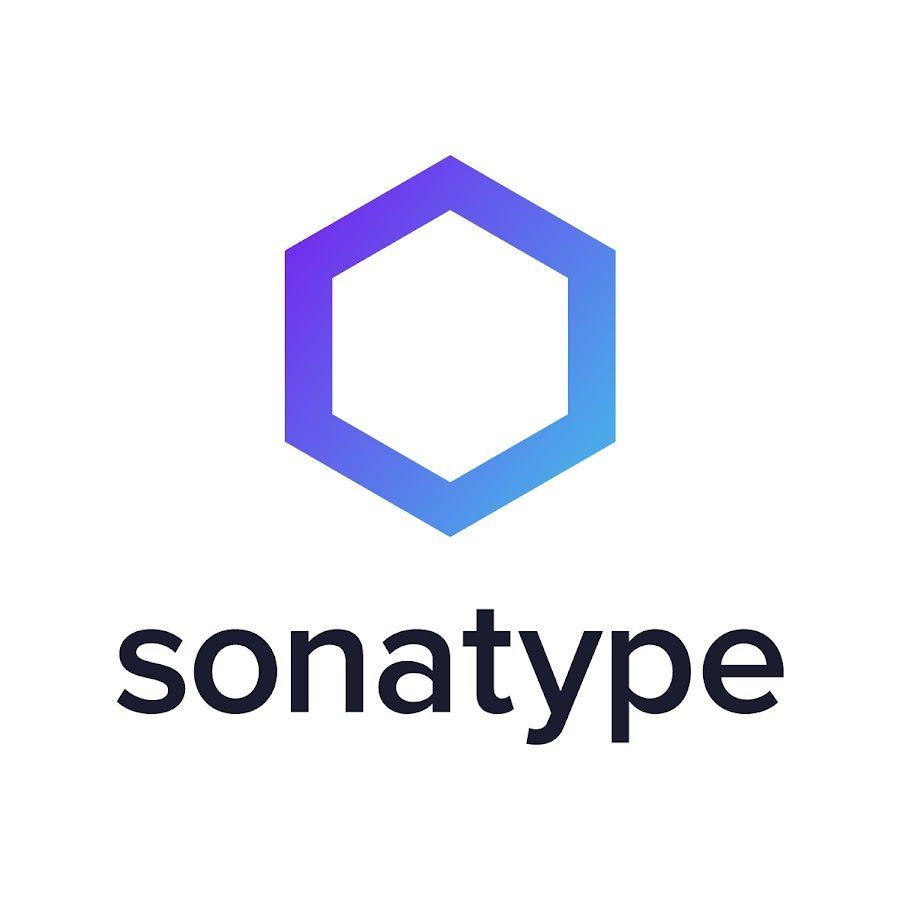
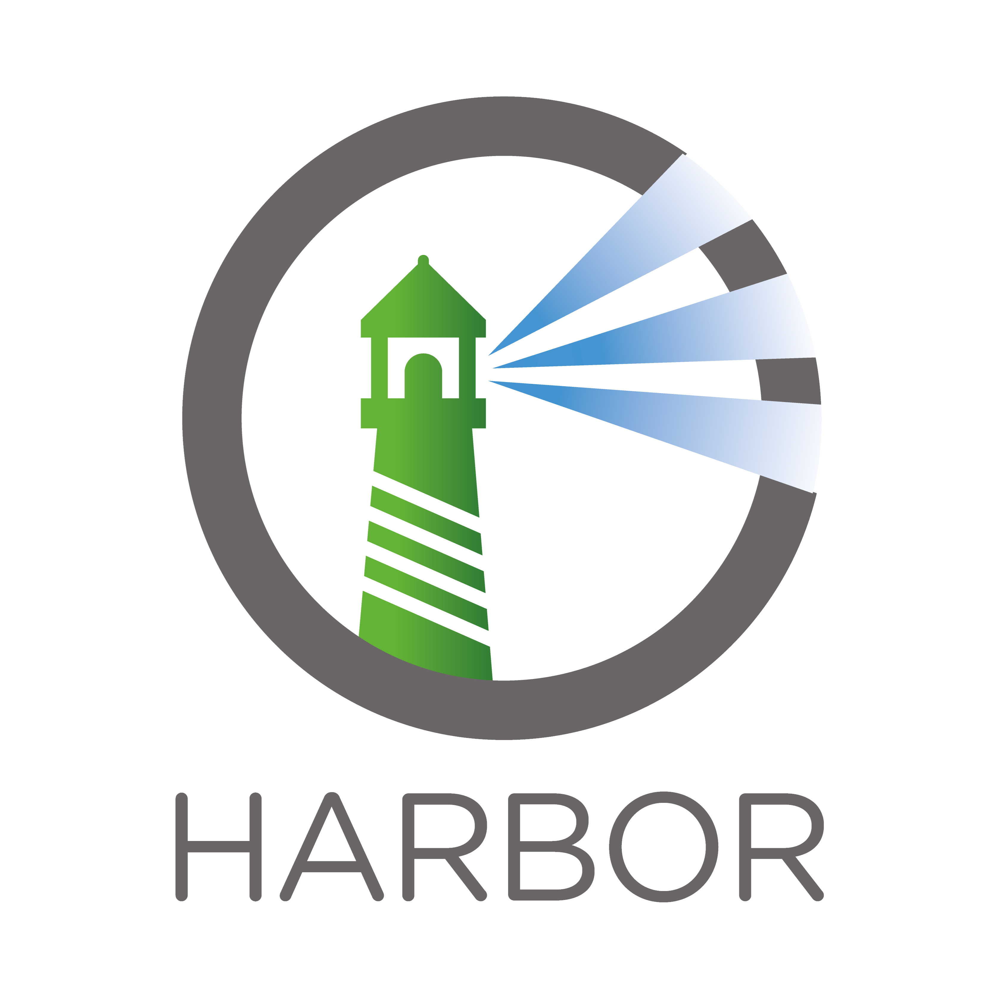
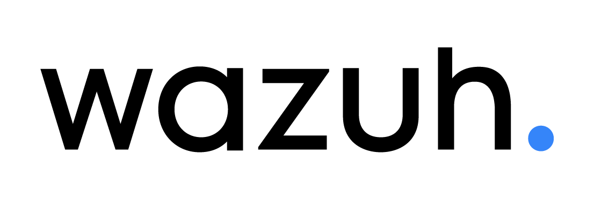

   

## 👋 About Me

My name is Grigoriy Khoroshilov, and I've been studying at HSE University since 2022, specializing in Information Security. I'm passionate about identifying vulnerabilities and developing countermeasures. Additionally, I'm studying machine learning to address further tasks within the CAVISE project, of which I'm a participant.

## 💡 Skills
- Programming
- CI/CD
- Cryptography
- Machine Learning
- OWASP Top 10
- Network Utilities

## 🔮 Projects

### CAVISE

CAVISE aims to enhance the accuracy of modeling and training connected and autonomous vehicles by developing an integrated simulation environment (based on Unreal Engine 4/5) and training through the integration and modification of existing high-precision simulation and training tools using deep reinforcement learning. [CAVISE](https://github.com/CAVISE)

---
<h3 align="center">Core Stack</h3>

  

<h3 align="center">Familiar With</h3>

  

<h3 align="center">Currently Learning</h3>

  

<h3 align="center">Next Up</h3>

  

---

### 🔧 Tools:

| VirtualBox | VMWare | Burpsuite |
|:----------:|:----------:|:----------:|
| 

 | 

 | 

 |

### ⚡ Services:
| Nexus | Harbor | DefectDojo | Vault Warden | Wazuh |
|:----------:|:----------:|:----------:|:----------:|:----------:|
| 

 | 

 | 

 | 

 | 

 |

### 💻 I’m currently working on CAVISE:
- Developing a simulator for modeling scenarios involving connected autonomous vehicles.
- Designing and implementing realistic traffic scenarios to test and evaluate the behavior and performance of autonomous systems.
- Developing a software implementation for data transmission between frameworks to enable detailed modeling of signal propagation between connected autonomous vehicles.
- Integrating various machine learning models into the simulation environment to enable comprehensive testing and analysis.
- Combining signal modeling and machine learning to improve autonomous vehicle simulations.

### 🎓 I’m currently learning:
- Vulnerabilities and information security to understand and mitigate potential threats to digital systems.
- Network security protocols and encryption techniques to protect data integrity and confidentiality.
- Ethical hacking and penetration testing to identify and address security weaknesses in various systems and applications.
- Machine Learning to create and train models for connected autonomous vehicles using deep reinforcement learning. My goal is to contribute to the development of safe and efficient autonomous transportation systems.

### Publications

---

- I. Doroshev, G. Khoroshilov and V. Stepanyants, "Evaluation of Cooperative Perception Algorithms in Simulation Environments with Realistic Communication Models," 2024 International Russian Automation Conference (RusAutoCon), Sochi, Russian Federation, 2024, pp. 943-947, doi: 10.1109/RusAutoCon61949.2024.10694627. (https://ieeexplore.ieee.org/document/10694627)

---

### 📈 My GitHub stats

---

  

    
  

---

  <h3>🌐 Contact</h3>
  

    
    &nbsp;
    
    &nbsp;
    
    &nbsp;
    
  

---

   

