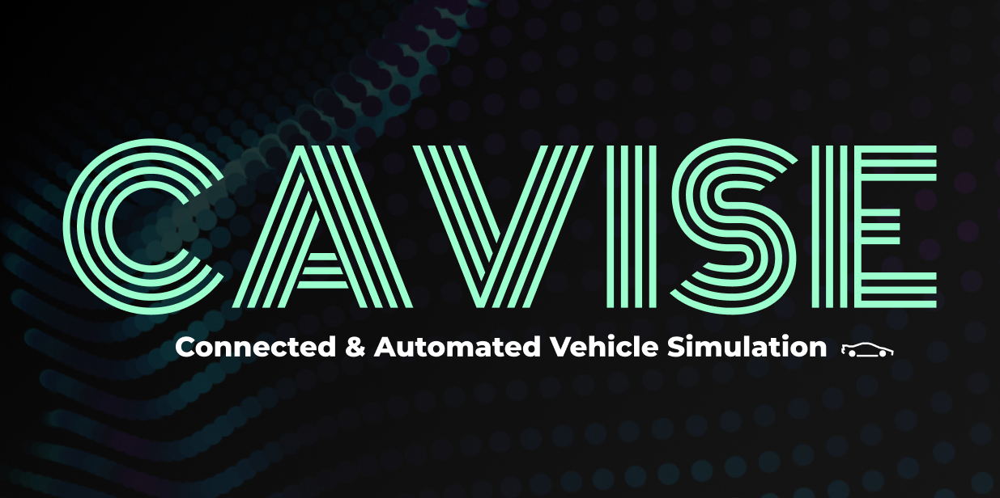

 

<!-- About Me -->

  <h3>👤 About Me</h3>

  

    My name is <strong>Grigoriy Khoroshilov</strong>, and I've been studying at <strong>HSE University</strong> since 2022, specializing in <strong>Information Security</strong>. 
    I'm passionate about identifying vulnerabilities and developing countermeasures. 
    Additionally, I'm studying <strong>machine learning</strong> to address further tasks within the <strong>CAVISE</strong> project, of which I'm a participant.
  

 

---
<!-- Projects -->
 

  <h3>🔮 Projects</h3>

  

    <strong>CAVISE</strong> aims to enhance the accuracy of modeling and training connected and autonomous vehicles by developing an integrated simulation environment (based on Unreal Engine 4/5).
    It focuses on training through the integration and modification of existing high-precision simulation and training tools using deep reinforcement learning.
  

  

 

---

 

<h3 align="center">Core Stack</h3>

  <a href="https://skillicons.dev">
    
 
    
 
     
     
     
     
  </a>

<h3 align="center">Familiar With</h3>

  <a href="https://skillicons.dev">
     
     
     
     
     
     
     
  </a>

<h3 align="center">Currently Learning</h3>

   
   
  

<h3 align="center">Next Up</h3>

  

 

---

 

  <h3>📚 Publications</h3>

<!-- Publication 1 -->

  

    <strong>I. Doroshev, G. Khoroshilov and V. Stepanyants</strong>, 
    "<i>Evaluation of Cooperative Perception Algorithms in Simulation Environments with Realistic Communication Models</i>", 
    2024 International Russian Automation Conference (RusAutoCon), Sochi, Russian Federation, 2024, pp. 943–947. 
    DOI: <a href="https://doi.org/10.1109/RusAutoCon61949.2024.10694627" target="_blank">10.1109/RusAutoCon61949.2024.10694627</a>
  

  

<!-- Publication 2 (in progress) -->

  

    <strong>I. Dolgov, G. Khoroshilov and V. Stepanyants</strong>, 
    "<i>CAVISE: Connected and Automated Vehicle Integrated Simulation Environment for Realistic … Modeling</i>", 
    🔄 <em>In progress — submission planned for ..., 2025</em>
  

  

 

---

 

  

    
  

 

  <h3>🌐 Contact</h3>
    <a href="https://t.me/Haralishev77" target="_blank" align="center">
       
    </a>
    <a href="mailto:khorogri@gmail.com" target="_blank" align="center">
       
    </a>
    <a href="https://github.com/Haralishev77" target="_blank align="center"">
       
    </a>
    

 

