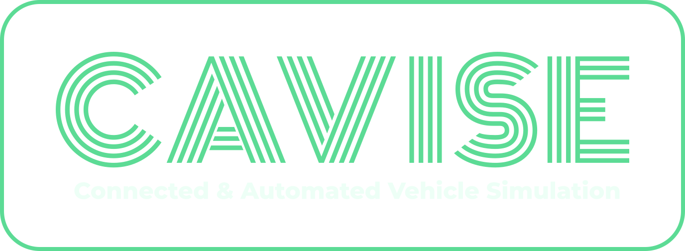
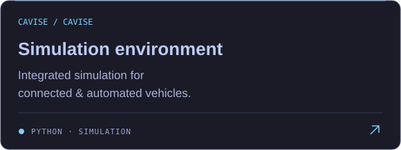
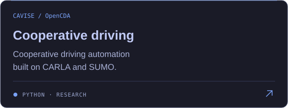
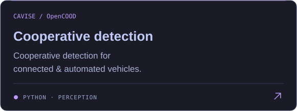
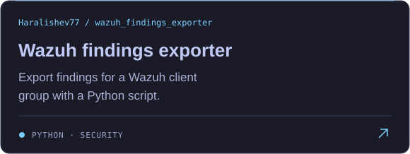
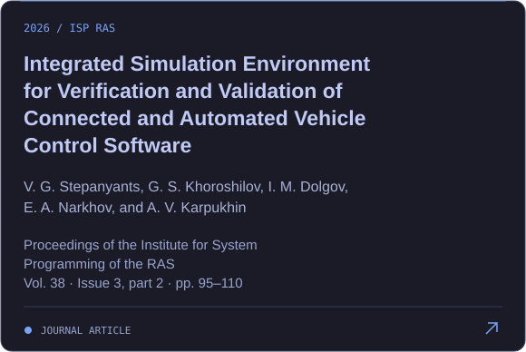
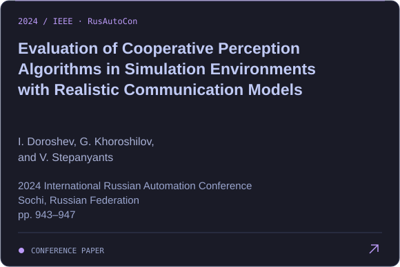
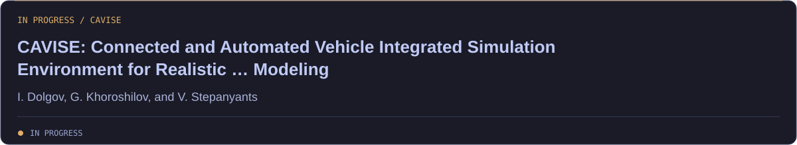

<!-- Original SVG artwork lives in assets/. Text and links remain editable here. -->

  
  
  
  
  
  
  

  
  
  
  

<table>
<tr>
<td width="58%" valign="top">
<h3>A little about me</h3>

I'm Grigoriy, a <strong>master's student at HSE University, MIEM</strong>, and a contributor to <strong>CAVISE</strong>.

My research interests center on connected &amp; automated vehicles and cooperative perception: how vehicles share information and how we can evaluate their behavior in simulation.

Alongside research, I work on <strong>application security, DevSecOps, and detection engineering</strong>.

</td>
<td width="42%" valign="top">
<h3>On GitHub</h3>

<a href="https://github.com/Haralishev77?tab=repositories">Browse my repositories ↗</a>

</td>
</tr>
</table>

<tr><td>
<h3>Connected and Automated Vehicle Integrated Simulation Environment</h3>

I contribute to CAVISE, which brings vehicle behavior, perception, traffic, and wireless communication into a shared simulation environment. The goal is to evaluate software for connected &amp; automated vehicles and cooperative perception algorithms under realistic conditions.

<strong>Research focus</strong> Connected &amp; automated vehicles · Cooperative perception · Verification and validation

</td></tr>

  
  

  
  

  
  

  

| Area | What I work on |
| :--- | :--- |
| **Secure development** | SSDLC processes, security audits, and actionable security requirements. |
| **Delivery & infrastructure** | Rootless Docker deployments and CI/CD pipelines with SAST, SCA, SBOM generation, and automated report uploads. |
| **Detection engineering** | Security monitoring with Wazuh, custom decoders and detection rules, and YARA rules. |
| **Incident response** | Malware and attack-script analysis, incident reports, and response automation. |

**Core tools**

  
  
  
  
  
  
  
  

**More tools I've worked with**

  
  
  
  
  
  
  
  
  

**Currently exploring**

  
  
  

**National Research University Higher School of Economics** · Moscow, Russia 
MIEM · Department of Computer Engineering

| Period | Degree / status |
| :--- | :--- |
| **August 2026 – Present** | **Master's student** |
| September 2022 – August 2026 | Bachelor's degree completed · Information Security |
